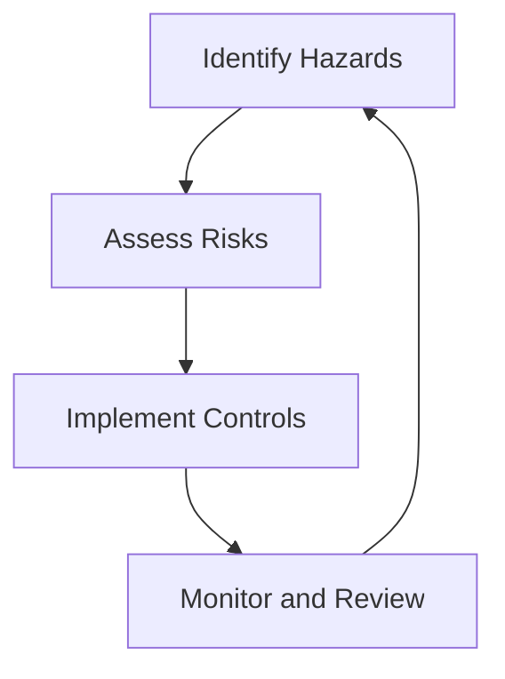
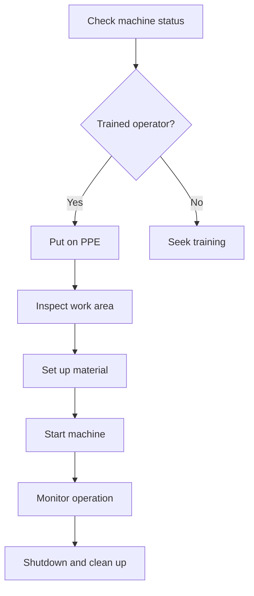
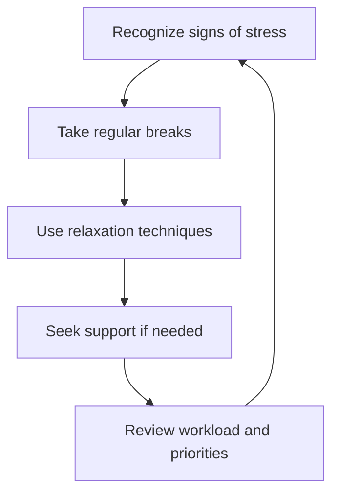
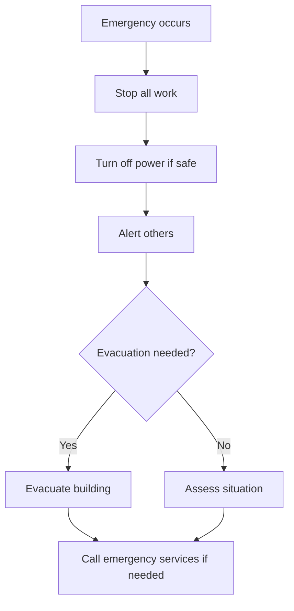

# Whack: Health and Safety Policy

## Introduction

At Whack, everyone must look after their own safety and the safety of others. This policy outlines what we will do to keep everyone safe, healthy, and mentally well in our hackerspace.

## Our Commitment

Whack is committed to providing a safe, healthy, and supportive environment for all members, visitors, and volunteers. We will:

1. Comply with all relevant health and safety laws and regulations
2. Identify and manage physical and mental health and safety risks
3. Ensure all members are trained in safe use of equipment
4. Promote a culture of safety awareness and mental wellbeing
5. Continuously improve our health and safety practices

## Responsibilities

### Whack Management:

- Engage with members on physical and mental health and safety matters
- Identify and assess risks, including those related to mental health
- Develop and review health and safety procedures
- Provide appropriate personal protective equipment (PPE)
- Ensure all equipment is properly maintained
- Investigate incidents and implement preventive measures
- Foster a supportive and inclusive community environment

### Members and Visitors:

- Follow all safety instructions, rules, and procedures
- Use PPE when required
- Report any hazards, accidents, or near-misses
- Do not operate equipment without proper training
- Look out for the physical and mental wellbeing of others
- Respect others and contribute to a positive community atmosphere

## Risk Management

We will use the following process to manage physical and mental health risks:

## Specific Safety Procedures

### CNC Machines and Laser Cutters

1. Only trained and authorized members may operate these machines
2. Always wear appropriate PPE (safety glasses, closed-toe shoes)
3. Never leave machines unattended while operating
4. Follow lockout/tagout procedures during maintenance
5. Keep work area clean and free of obstacles

## Mental Health and Wellbeing

Whack recognizes the importance of mental health and is committed to fostering a supportive environment. We will:

1. Promote work-life balance and encourage regular breaks
2. Provide a quiet space for relaxation or meditation
3. Organize social events to build community and reduce isolation
4. Offer mental health first aid training to interested members
5. Maintain a zero-tolerance policy for bullying or harassment

### Stress Management

## Emergency Procedures

In case of emergency:

1. Stop all work immediately
2. Turn off power to machines if safe to do so
3. Alert others in the area
4. Evacuate the building if necessary
5. Call emergency services if required

## Training

All members must complete safety training before using equipment. Training will include:

- General safety orientation
- Specific training on CNC machines and laser cutters
- Emergency procedures
- Proper use of PPE
- Mental health awareness and stress management techniques

## Incident Reporting

Report all accidents, near-misses, hazards, and concerns (including mental health concerns) to Whack management immediately. We will:

1. Record the incident or concern
2. Investigate the cause
3. Implement measures to prevent recurrence
4. Review and update procedures as necessary
5. Provide support and resources as needed

## Mental Health Support

Whack is committed to supporting members' mental health:

1. We will maintain a list of local mental health resources and helplines
2. Members are encouraged to speak with management if they need support
3. We will respect privacy and confidentiality in all mental health matters
4. Regular check-ins and feedback sessions will be conducted to assess community wellbeing

## Policy Review

This policy will be reviewed annually and updated as needed. All members will be notified of any changes.

Approved by: [Management Name]
Date: [Current Date]
Next review date: [One year from current date]
